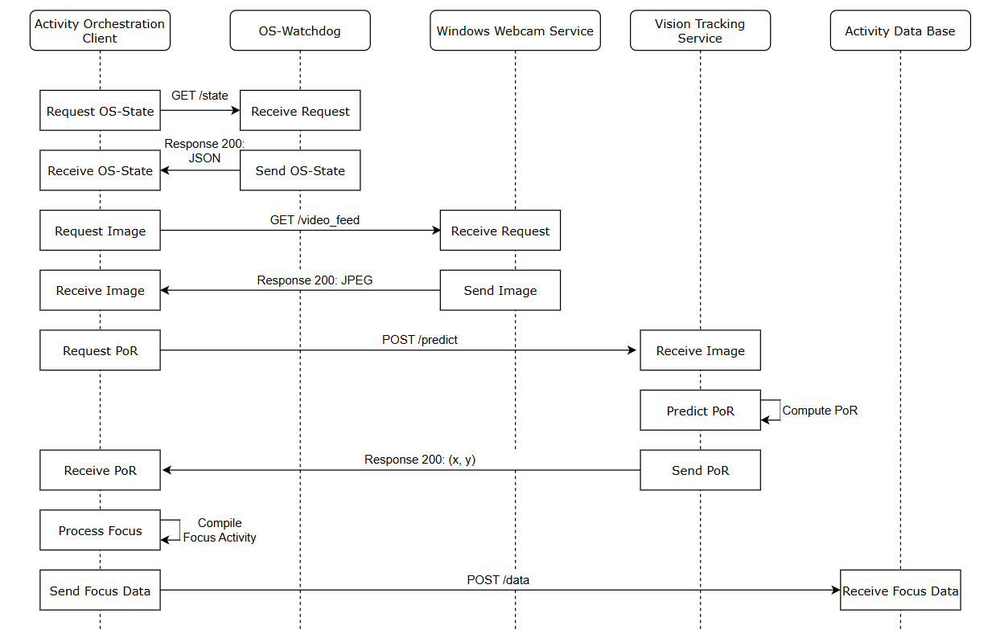

# attention-orchestrator
An orchestration tool leveraging a vision tracking service and OS data to report on a user's attention distribution

## Lifecycle Sequence Diagram

  
  
<strong>Fig 2.</strong> Sequence diagram of the Application Lifecycle.

