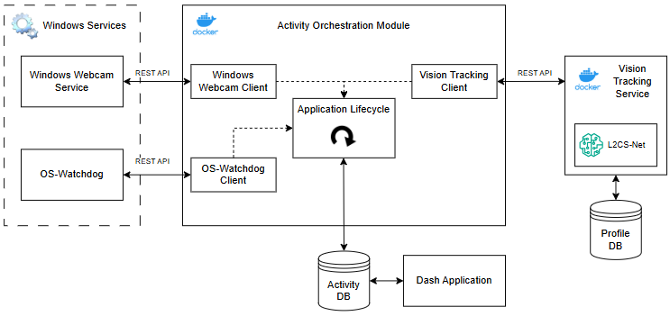
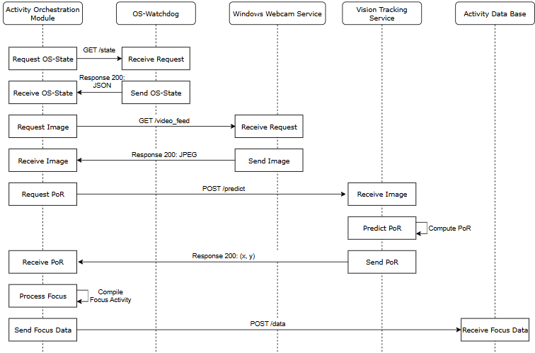

# Activity Orchestration Module
An orchestration tool leveraging a vision tracking service and OS data to report on a user's attention distribution

## Reflective Application Architecture

This dockerized module sits at the center of the Reflective Application, connecting to the required services, running the core application lifecycle and user-interfaces.

  
  
<strong>Fig 1.</strong> High-Level Architecture diagram of the Reflective Application and how the Activity Orchestration Module fits into it.

## Lifecycle Sequence Diagram

The core responsibility of the Activity Orchestration Module is running the Application Lifecycle once the initial calibration and calibration profile selection or creation is completed. Its goal is to combine the Point of Regard and Operating System activity to compile data on the user's focus.

  
  
<strong>Fig 2.</strong> Sequence diagram of the Application Lifecycle.

